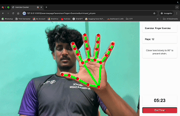

## Team Itachi - Web Application
Web application that uses live camera feeds to guide users through doctor-recommended physio exercises and yoga. Our primary focus is to encourage the users to follow exercises without daily doctor consultations. The app includes an AI-powered chatbot to provide personalized suggestions and answer user queries. Additionally, users can upload exercise videos for feedback. This innovative platform offers a time-saving solution to support mental health effectively and conveniently.




## For Testing
For testing purpose, use Exercises and go to Bicep Curl. That's our working model
Try out our AI chat bot asking questions related to your physitherapy or exercise doubts

Since we had the time constraints, we did a physiotherapy model and couldn't able to add it to our system.
You can seperately check that by running `physio.py`

## Features
- **Live Camera Guidance**: Provides real-time instructions for doctor-recommended psycho exercises and yoga through live camera feeds.
- **AI-Powered Chatbot**: Offers personalized suggestions and answers user queries related to mental health and exercises.
- **Video Feedback System**: Users can upload exercise videos to receive detailed feedback and improvement tips.
- **Doctor-Free Guidance**: Encourages users to follow prescribed exercises without the need for daily doctor consultations.
- **User-Friendly Interfac**e: Simple and intuitive design for easy navigation and exercise tracking.
- **Progress Monitoring**: Tracks user activity over time and provides insights on performance and consistency.
- **Accessibility & Convenience**: Supports users in maintaining mental wellness anytime, anywhere.
- **Personalized Experience**: Tailors exercise suggestions based on user preferences and doctor recommendations.


## Technologies Used
- **Python**
- **OpenCV**
- **Mediapipe**
- **OpenAI**
- **Steamlit**
- **langchain**
- **Flask**

## Installation
1. Git clone the project:
   ```bash
   clone https://github.com/dreamspace-academy/dreamhack-2025-itachi.git
   cd dreamhack-2025-itachi

2. Install the dependencies:
   ```bash
   pip install -r requirements.txt

3. Setup `.env` file with the APIs

4. Run the program using:
   ```bash
   python app.py

## Issues and resolution
- **Issue with camera feed**: If you encounter any issues with camera try changing `cap = cv2.VideoCapture(0)` in `bicep_curl.py` file
